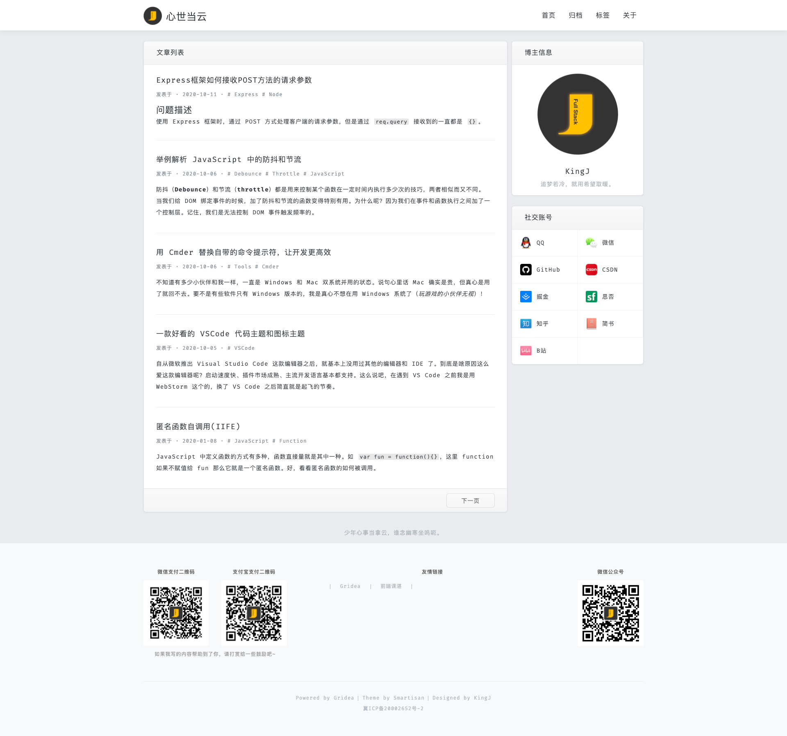
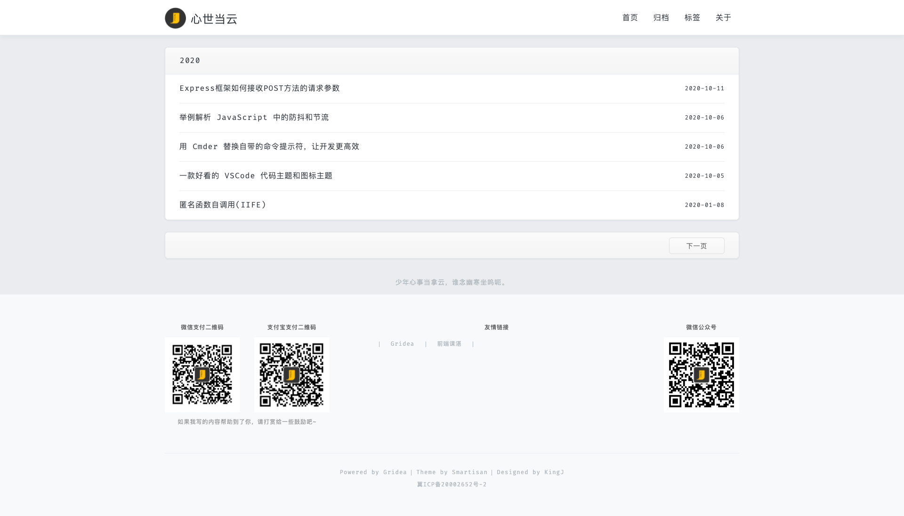
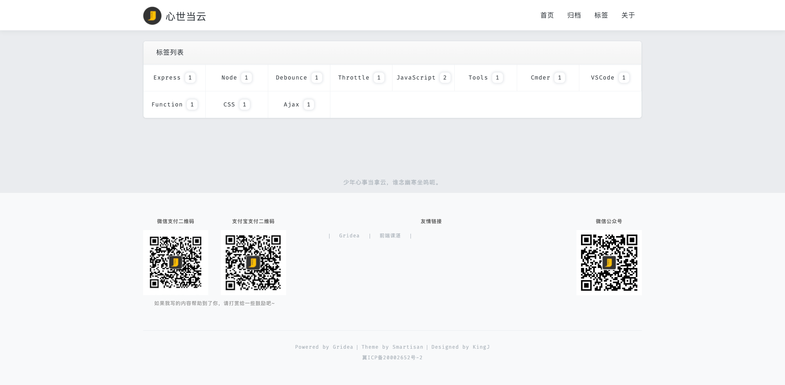
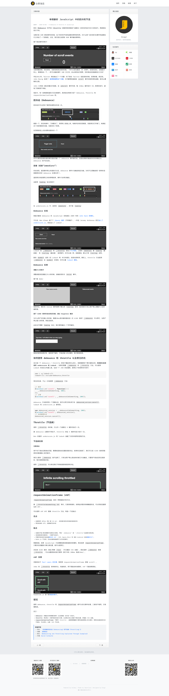

> 作者本人是一锤粉，很喜欢锤子手机的工业设计和系统设计。所以才做了这个主题，一款风格上仿锤子官网的主题。

## 先上效果图

先看看效果图怎么样，咱们再说功能和想法吧~

在线预览请访问：[Demo](https://jinyunlong.cc)

### 主页

### 归档页面

### 标签页面

### 文章页面

## 主题功能介绍

### 初始版本

目前本主题是初始版本，仅在效果风格上实现了与锤子官方网站相似而已，还有很多需要优化的和补充的地方。目前已经实现了的功能：

- 网站配置：补充了一些网站信息和个人信息
  - 网站Logo：显示在页面导航栏上面的Logo。*Gridea默认的头像配置为博主的个人头像*
  - 个人昵称：博主的个人昵称。*Gridea默认仅提供了网站名称，缺少博主的个人昵称*
  - 个性签名：博主昵称下面显示的签名。*Gridea默认仅提供了网站描述，缺少博主的个人签名*
  - ICP备案号
  - 公安备案号
- 关注公众号：在网站底部信息栏的右侧显示，方便在个人网站推广有公众号的博主
- 打赏功能：在网站底部信息栏的左侧显示，可分别显示微信二维码和支付宝二维码
- 社交账号：社交图标使用的是锤子手机系统自带的图标风格（*有些图标未找到，如有网友能提供，作者万分感谢*）
- 友情链接：在网站底部信息栏的居中显示，最多可添加30个友情链接

### 下一版计划

这一版本主要集中在实现风格效果，以及完成一些个人网站博主常用的功能。还未完成的功能还有很多，下一版本更新计划：

- 优化Markdown文章渲染效果，将其显示风格与网站风格更为匹配
- 新增广告栏功能，一是显示在主页右侧边栏，一是显示在文章右侧边栏，一是显示在文章详细内容的最后面（*以上三个位置暂定*）
- 新增文章页面右侧边栏显示文章目录功能

### 你希望增加的功能

作者是利用业余时间制作并维护本主题，时间上可能无法保证及时，但一定会持续维护下去~

- 如果你喜欢本主题，并且具备制作能力，可直接参与本主题的开发工作
- 如果你喜欢本主题，但不具备制作能力，可在 [Issues](https://github.com/fullstack-kingj/gridea-theme-smartisan/issues/new) 提交你的建议和想法

## 更新日志

## 感谢

- [Gridea](https://gridea.dev/)
- [gridea-theme-starter](https://github.com/getgridea/gridea-theme-starter)

